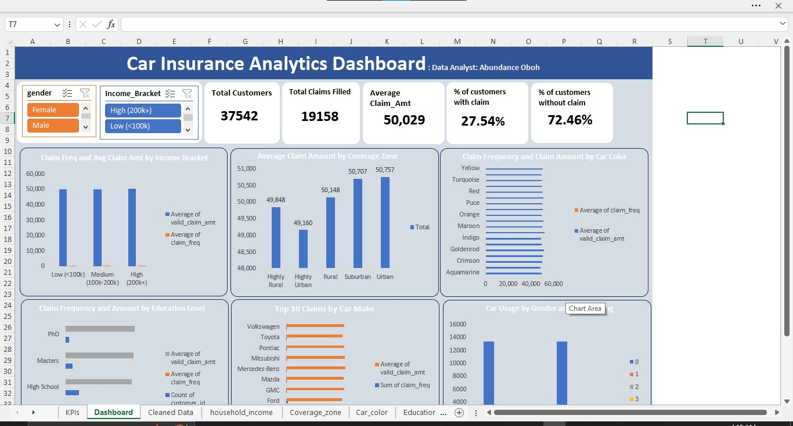
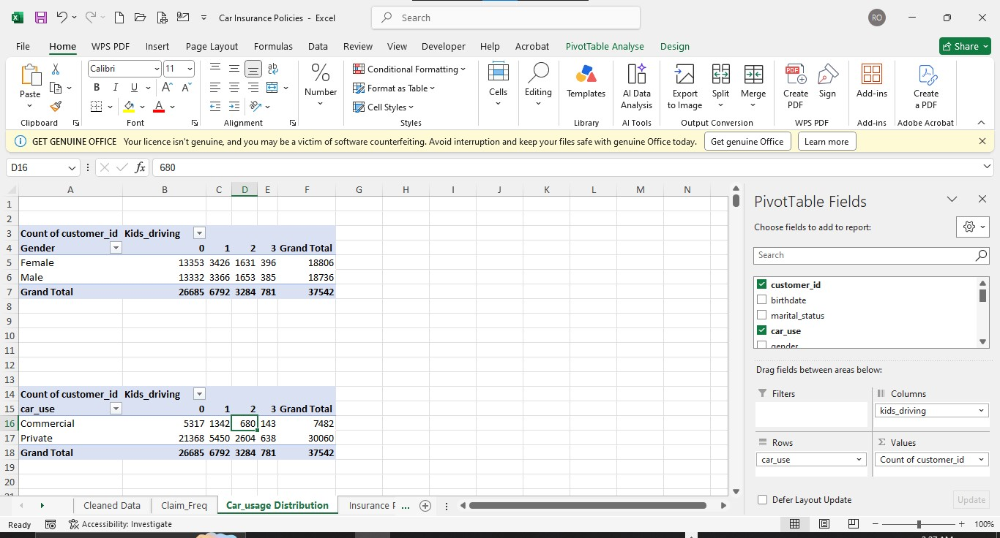
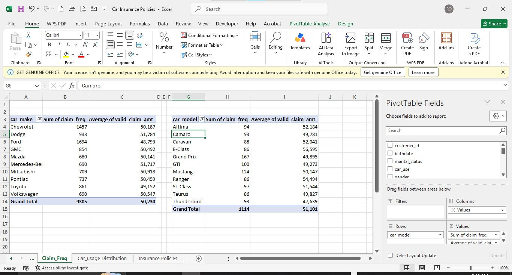
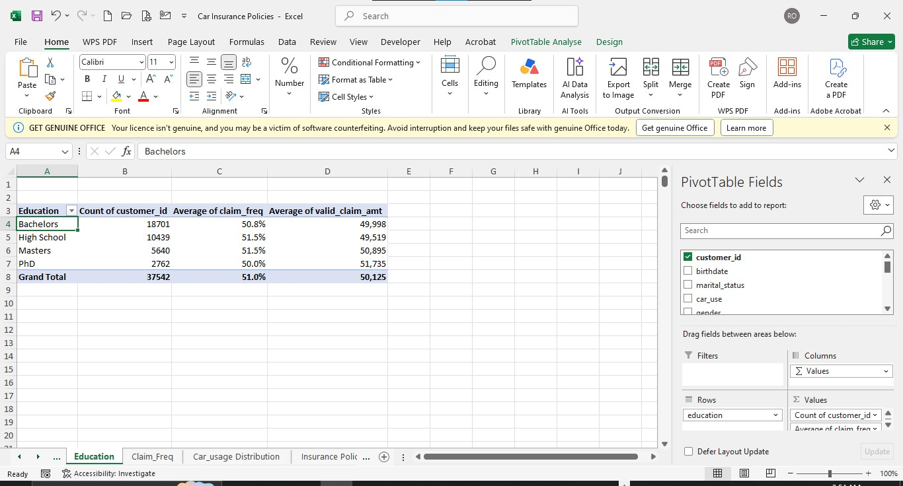
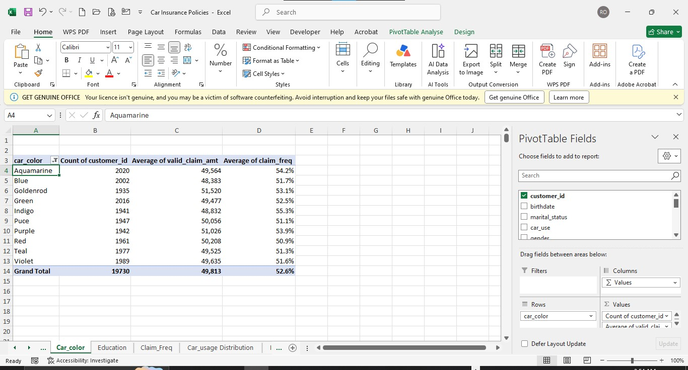
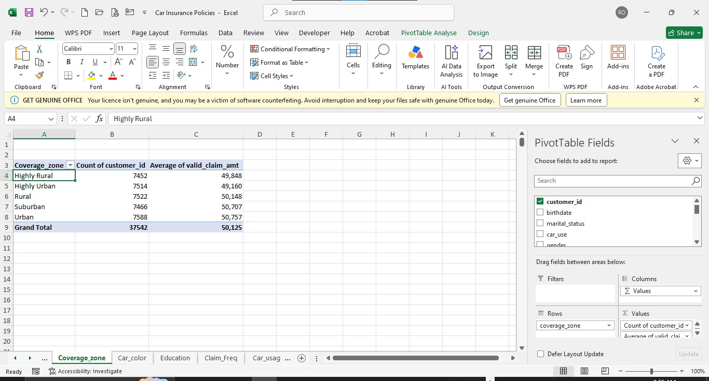
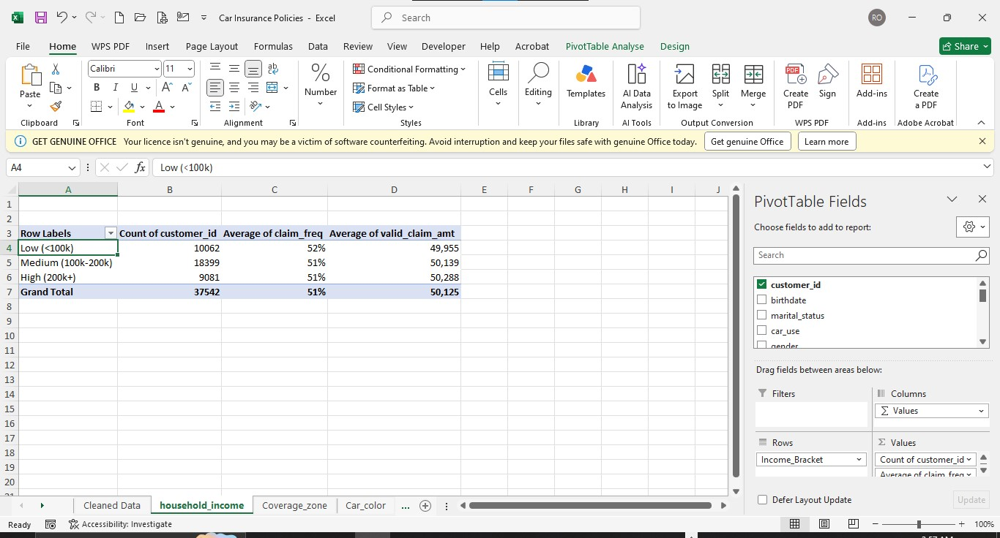

# Car Insurance Claims Analysis

**Analyst:** Abundance Oboh
**Tools:** Microsoft Excel, Power Query
**Dataset:** Car Insurance Policies — 37,542 customer records, 16 fields

---

## Project Overview

This project analyzes customer demographics, vehicle characteristics, and insurance claims behavior to answer six business questions:

1. How does car usage distribute across gender and number of kids driving?
2. Which car makes/models are most frequently involved in claims, and what's the average claim amount?
3. Is there a relationship between education level and claim frequency/amount?
4. How does car color relate to claim frequency and amount?
5. What's the average claim amount across coverage zones?
6. How does household income relate to claim frequency and amount?

*Interactive Excel dashboard with KPI cards, 6 chart panels, and Gender/Income Bracket slicers.*

---

## Data Cleaning (Power Query)

All cleaning was carried out in Power Query and every transformation is logged in Applied Steps and can be re-run if source data changes.

**Key cleaning decisions:**

| Issue Found | Fix Applied | Why |
|---|---|---|
| Duplicate ID (`56-5402470` on two unrelated customer records) | Assigned a new unique ID to one record | Both rows had entirely different data — these were two different customers coincidentally sharing an ID, not a true duplicate. Deleting either would discard valid data. |
| Encoding artifact: `"Citroën"` in car_make | Corrected to `"Citroën"` | A character-encoding garble, not a real data variant — left uncorrected it would appear as a separate/unknown manufacturer. |
| Spelling inconsistency: `"Seperated"` in marital_status | Standardized to `"Separated"` | Prevents this category from splitting into two groups in pivot tables. |
| `birthdate` failed to parse as a date (e.g., `4/21/1988`) | Used **Change Type with Locale → English (US)** | Power Query defaulted to a day/month locale, rejecting valid U.S.-format dates. |
| `claim_amt` shows non-zero values even when `claim_freq = 0` | Created `valid_claim_amt` (nulls out claim_amt where claim_freq = 0) | Source data illogically assigns claim amounts to customers with zero recorded claims (avg. ~$50K either way) — indicates claim_amt was generated independently of claim_freq. This derived field ensures every average in this analysis reflects genuine claims only. |

**Derived fields added:** `Age`, `Car_Age`, `Income_Bracket`, `valid_claim_amt`, `Has_Claim`.

**Notable debugging:** the `Age` calculation initially failed because it ran *before* the `birthdate`-to-Date conversion step in the query's execution order — Power Query runs steps strictly in sequence, so reordering the steps resolved it. A separate formula for `valid_claim_amt` initially returned the literal text `"null"` instead of a true blank, because the formula used a quoted string instead of the `null` keyword — corrected so pivot table averages handle it correctly.

---

## Key Findings

### 1. Car Usage by Gender and Kids Driving
Male and female customers show virtually identical patterns — ~71% of each gender has zero kids driving their car, with the remaining ~29% split almost identically across 1, 2, and 3 kids. The same holds for car use type (private vs. commercial). **Neither factor meaningfully predicts household driver-sharing.**

### 2. Claims by Car Make and Model
**Ford** leads in total claims (1,694) among top makes, but average claim amount is nearly flat across makes ($48,793–$51,784). By model, the **Mercedes-Benz E-Class** stands out with a notably higher average claim amount ($56,595) than every other top model — the single most visible signal in this entire analysis, worth a follow-up look given its smaller sample size.

### 3. Education Level vs. Claims
Claim frequency (50.0%–51.5%) and claim amount ($49,519–$51,735) are essentially flat across all education levels. **No meaningful relationship found.**

### 4. Car Color vs. Claims
Claim frequency (50.9%–55.3%) and claim amount ($48,383–$51,520) show no clear pattern by color — consistent with the expectation that color isn't a real insurance risk factor.

### 5. Claim Amount by Coverage Zone
Average claim amount ranges $49,160 (Highly Urban) to $50,757 (Urban) — notably, **Highly Urban shows the lowest average, not the highest**, running counter to the common "urban = costlier claims" assumption.

### 6. Household Income vs. Claims
Claim frequency (51–52%) and claim amount ($49,955–$50,288) are flat across all three income brackets. **No meaningful relationship found.**

---

## The Bigger Picture

Across all six questions, claim frequency and claim amount stay within a narrow band regardless of the demographic or vehicle factor tested. Combined with the claim_amt/claim_freq inconsistency found during cleaning, this suggests claims-related fields in this dataset were generated independently of the demographic fields rather than reflecting real underlying relationships. **Reporting this pattern honestly — instead of overstating small numeric differences as meaningful findings — is the core analytical takeaway of this project.**

---

## Data Limitations

- Car colors (e.g., "Fuscia," "Mauv," "Goldenrod") and unusual car makes alongside real manufacturers suggest this is a synthetic/generated dataset — findings are presented as a demonstration of method, not real-world business conclusions.
- Claim-amount averages throughout this analysis use the derived `valid_claim_amt` field (claims only), not the raw `claim_amt` column, for the reasons noted above.
- Q2 results are based on the Top 15 makes/models by claim volume, not the full 78 makes / 1,011 models, given the long tail of low-volume categories.
- Findings represent comparisons of group averages, not formal statistical correlation coefficients.

---

## Files in This Repo

- `Car_Insurance_Policies_analysis.xlsx` — full workbook (cleaned data, pivot tables, dashboard)
- `images/` — dashboard and process screenshots referenced above
